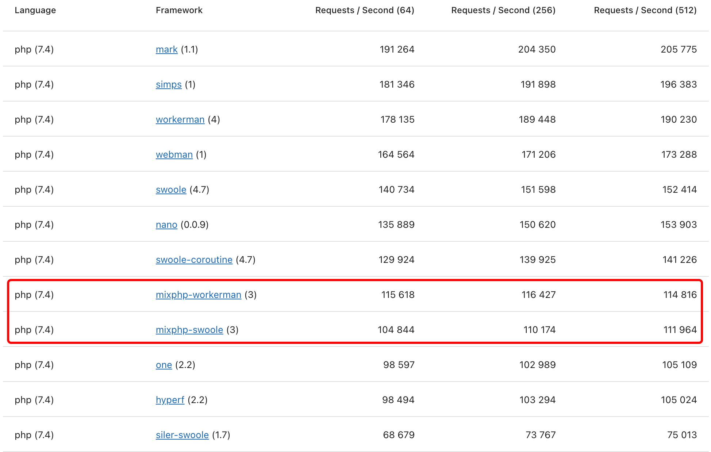

<h1 align="center">Mix PHP</h1>

[中文](README.md) | English

MixPHP is a PHP command-line development framework; HTTP based on `Vega` can support both Swoole, Swow, WorkerMan, FPM, CLI-Server ecosystems at the same time, and can be switched seamlessly; `V3` is a highly decoupled version, the overall code is based on multiple independent Even if users do not use our scaffolding, they can also use these independent modules, and all modules support native development. For example: you can only use mix/vega to work with laravel orm; you can use mix/database and mix/redis in any environment; you can use mix/grpc native code to write gRPC; all modules can be combined like building blocks.

## Standalone module

All core modules can be used independently, and all support native code development.

- [mix/vega](src/vega) CLI mode HTTP network framework written in PHP, supports Swoole, Swow, WorkerMan, FPM, CLI-Server
- [mix/database](src/database) Lightweight database that can be used in various environments, supports FPM, CLI, Swoole, WorkerMan, optional connection pool (coroutine)
- [mix/redis](src/redis) PHP Redis that can be used in various environments, supports FPM, CLI, Swoole, WorkerMan, optional connection pool (coroutine)
- [mix/redis-subscriber](src/redis-subscriber) Redis native protocol subscription library based on Swoole coroutine
- [mix/grpc](src/grpc) PHP gRPC library based on Swoole coroutine, including protoc code generator, server, client
- [mix/websocket](src/websocket) PHP WebSocket server and client based on Swoole coroutine
- [mix/cli](src/cli) PHP command line interactive commander
- [mix/worker-pool](src/worker-pool) Swoole-based worker pool, coroutine pool
- [mix/validator](src/validator) PSR-7-based verification library
- [mix/event](src/event) Event dispatcher based on PSR-14 standard
- [mix/init](src/init) Help execute static initialization of the class, usually for preloading singletons

## Server

Support multiple server drivers, and can switch seamlessly.

- [PHP Built-in CLI-Server](examples/api-skeleton/composer.json#L8)
- [PHP-FPM](examples/api-skeleton/public/index.php)
- [Swoole](examples/api-skeleton/composer.json#L9)
- [Swoole Coroutine](examples/api-skeleton/composer.json#L10)
- [Swow](examples/api-skeleton/composer.json#L11)
- [WorkerMan](examples/api-skeleton/composer.json#L12)

## Documentation

- `V3.0` 1.[Quick start](#Quick-start) 2.[Server](#Server) 3.[Standalone module](#Standalone-module)
- `V2.2` https://www.kancloud.cn/onanying/mixphp2-2/content
- `V2.1` https://www.kancloud.cn/onanying/mixphp2-1/content
- `V2.0` https://www.kancloud.cn/onanying/mixphp2/content
- `V1.*` https://www.kancloud.cn/onanying/mixphp1/content

## Quick start

Provide ready-made scaffolding, quickly create projects, immediate output.

- [Write a CLI program](examples/cli-skeleton#readme)

```
composer create-project --prefer-dist mix/cli-skeleton cli
```

- [Write a API interface](examples/api-skeleton#readme)

```
composer create-project --prefer-dist mix/api-skeleton api
```

- [Write a web page](examples/web-skeleton#readme)

```
composer create-project --prefer-dist mix/web-skeleton web
```

- [Write a WebSocket service](examples/websocket-skeleton#readme)

```
composer create-project --prefer-dist mix/websocket-skeleton websocket
```

- [Write a gRPC interface](examples/grpc-skeleton#readme)

```
composer create-project --prefer-dist mix/grpc-skeleton grpc
```

## Benchmarks

- [TechEmpower Benchmark](https://www.techempower.com/benchmarks/#section=test&runid=1922b097-2d7f-413c-be21-9571c8302734&hw=ph&test=db&l=yyku7z-e7&a=2)


- [Web Frameworks Benchmark](https://web-frameworks-benchmark.netlify.app/result?l=php)



## Golang framework

OpenMix also has Golang ecological framework

- https://github.com/mix-go/mix
- https://gitee.com/mix-go/mix

## License

Apache License Version 2.0, http://www.apache.org/licenses/
