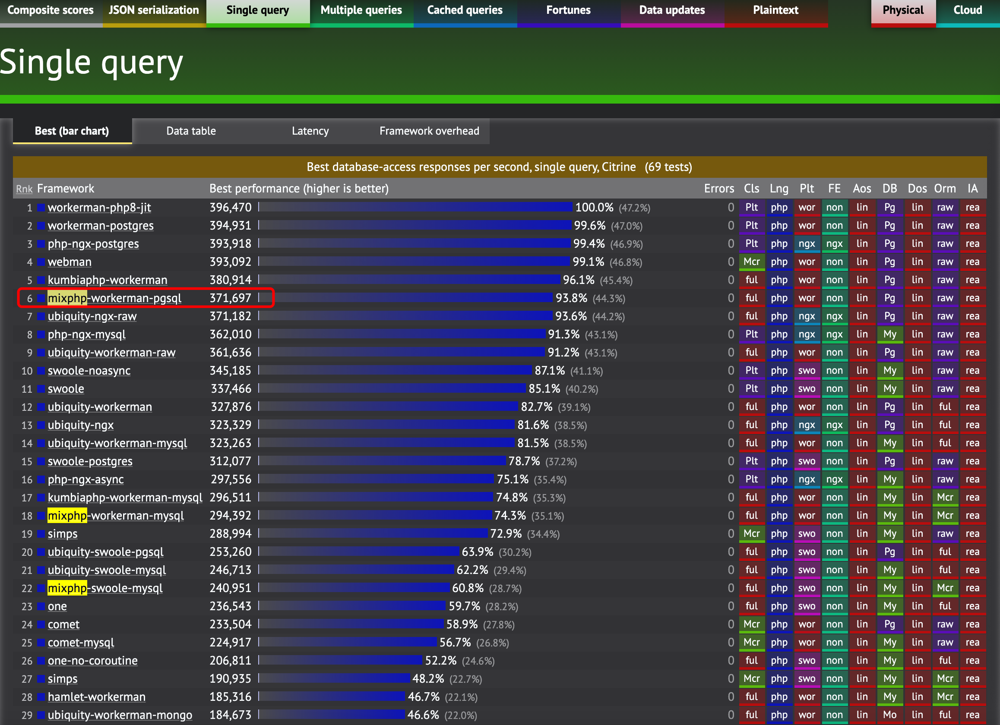

## TechEmpower Benchmark

TechEmpower 的测试比较科学，包含 SQL 查询、JSON 序列化等各种测试，同时标注了哪些是使用了 ORM，哪些是 RAW 查询。

- [TechEmpower Benchmark](https://www.techempower.com/benchmarks/#section=test&runid=1922b097-2d7f-413c-be21-9571c8302734&hw=ph&test=db&l=yyku7z-e7&a=2)
- 在 WorkerMan 平台下：MixPHP 与 WorkerMan 官方的 webman 旗鼓相当相差很小，在实际生产中由于 webman 是使用的 laveral orm，性能要比 mix/database 低很多。
- 在 Swoole 平台下：MixPHP 也只比 simps 低一些，但是由于 simps 使用的原生查询，因此综合性能 MixPHP 应该更高一些。

## Web Frameworks Benchmark

这个测试只包含路由与 echo 测试，因此只能证明基础平台协议解析与框架路由的性能。

- [Web Frameworks Benchmark](https://web-frameworks-benchmark.netlify.app/result?l=php)
- 由于这个测试的规则特性，有些框架采用 TCP 直接解析请求参数、TCP 直接发送 HTTP 协议字符串的方式投机，MixPHP 没有这么做，性能依然高于流行的大部分其他框架。

